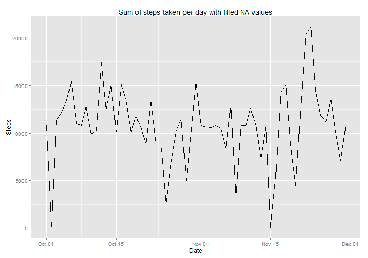
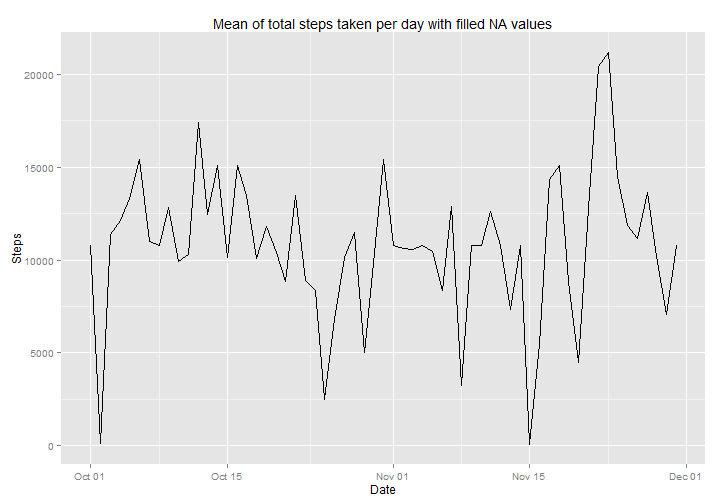
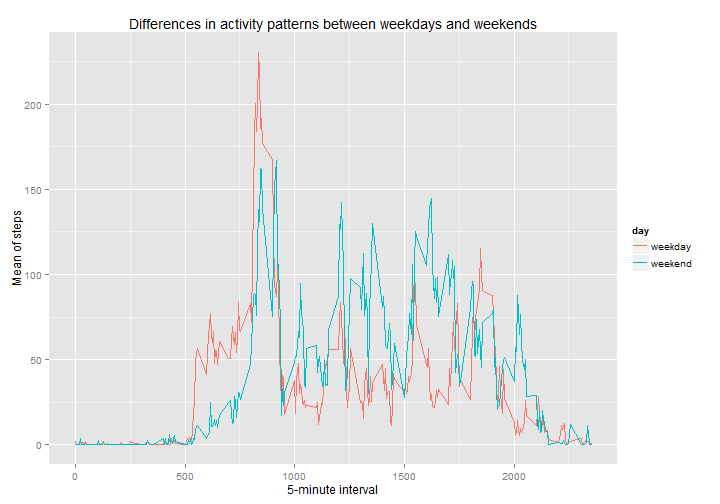

Load the ggplot2 library


```r
library("ggplot2")
```

Set locale to avoid different month and weekday names


```r
Sys.setlocale("LC_TIME", "English")
```

```
## [1] "English_United States.1252"
```

##Loading and preprocessing the data

###Loading data

Read the **activity.csv** file with the activity data. We assume that the file resides in the current working directory. The default parameters are just fine


```r
activity.data <- read.csv("activity.csv")
```

###Transform data

We need to transform the **date** column to **Date** type


```r
activity.data[, "date"] <- as.Date(activity.data[, "date"], format = "%Y-%m-%d")
```

##Questions

###Mean total number of steps taken per day

Total number of steps taken each day


```r
# group by date and report the sum of steps taken per day
sum.steps.by.date <- aggregate(steps ~ date, data = activity.data, sum)

# plot the sum
with (sum.steps.by.date, {
    qplot(
       date, 
       steps,
       main = "Sum of steps taken per day",
       xlab = "Date", 
       ylab = "Steps",
       geom = "line"
    )
})
```

 

```r
# print the aggregated data
sum.steps.by.date
```

```
##          date steps
## 1  2012-10-02   126
## 2  2012-10-03 11352
## 3  2012-10-04 12116
## 4  2012-10-05 13294
## 5  2012-10-06 15420
## 6  2012-10-07 11015
## 7  2012-10-09 12811
## 8  2012-10-10  9900
## 9  2012-10-11 10304
## 10 2012-10-12 17382
## 11 2012-10-13 12426
## 12 2012-10-14 15098
## 13 2012-10-15 10139
## 14 2012-10-16 15084
## 15 2012-10-17 13452
## 16 2012-10-18 10056
## 17 2012-10-19 11829
## 18 2012-10-20 10395
## 19 2012-10-21  8821
## 20 2012-10-22 13460
## 21 2012-10-23  8918
## 22 2012-10-24  8355
## 23 2012-10-25  2492
## 24 2012-10-26  6778
## 25 2012-10-27 10119
## 26 2012-10-28 11458
## 27 2012-10-29  5018
## 28 2012-10-30  9819
## 29 2012-10-31 15414
## 30 2012-11-02 10600
## 31 2012-11-03 10571
## 32 2012-11-05 10439
## 33 2012-11-06  8334
## 34 2012-11-07 12883
## 35 2012-11-08  3219
## 36 2012-11-11 12608
## 37 2012-11-12 10765
## 38 2012-11-13  7336
## 39 2012-11-15    41
## 40 2012-11-16  5441
## 41 2012-11-17 14339
## 42 2012-11-18 15110
## 43 2012-11-19  8841
## 44 2012-11-20  4472
## 45 2012-11-21 12787
## 46 2012-11-22 20427
## 47 2012-11-23 21194
## 48 2012-11-24 14478
## 49 2012-11-25 11834
## 50 2012-11-26 11162
## 51 2012-11-27 13646
## 52 2012-11-28 10183
## 53 2012-11-29  7047
```

The following is the mean of the total number of steps


```r
mean.steps <- mean(sum.steps.by.date$steps)
mean.steps
```

```
## [1] 10766.19
```

The following is the median of the total number of steps


```r
median.steps <- median(sum.steps.by.date$steps)
median.steps
```

```
## [1] 10765
```

Mean and median of the total number of steps taken per day


```r
# group by date and report the mean of steps taken per day
mean.steps.by.date <- aggregate(steps ~ date, data = sum.steps.by.date, mean)

# plot the mean
with (mean.steps.by.date, {
    qplot(
        date, 
        steps, 
        main = "Mean of total steps taken per day",
        xlab = "Date", 
        ylab = "Steps", 
        geom = "line"
    )
})
```

 

```r
# print the aggregated data
mean.steps.by.date
```

```
##          date steps
## 1  2012-10-02   126
## 2  2012-10-03 11352
## 3  2012-10-04 12116
## 4  2012-10-05 13294
## 5  2012-10-06 15420
## 6  2012-10-07 11015
## 7  2012-10-09 12811
## 8  2012-10-10  9900
## 9  2012-10-11 10304
## 10 2012-10-12 17382
## 11 2012-10-13 12426
## 12 2012-10-14 15098
## 13 2012-10-15 10139
## 14 2012-10-16 15084
## 15 2012-10-17 13452
## 16 2012-10-18 10056
## 17 2012-10-19 11829
## 18 2012-10-20 10395
## 19 2012-10-21  8821
## 20 2012-10-22 13460
## 21 2012-10-23  8918
## 22 2012-10-24  8355
## 23 2012-10-25  2492
## 24 2012-10-26  6778
## 25 2012-10-27 10119
## 26 2012-10-28 11458
## 27 2012-10-29  5018
## 28 2012-10-30  9819
## 29 2012-10-31 15414
## 30 2012-11-02 10600
## 31 2012-11-03 10571
## 32 2012-11-05 10439
## 33 2012-11-06  8334
## 34 2012-11-07 12883
## 35 2012-11-08  3219
## 36 2012-11-11 12608
## 37 2012-11-12 10765
## 38 2012-11-13  7336
## 39 2012-11-15    41
## 40 2012-11-16  5441
## 41 2012-11-17 14339
## 42 2012-11-18 15110
## 43 2012-11-19  8841
## 44 2012-11-20  4472
## 45 2012-11-21 12787
## 46 2012-11-22 20427
## 47 2012-11-23 21194
## 48 2012-11-24 14478
## 49 2012-11-25 11834
## 50 2012-11-26 11162
## 51 2012-11-27 13646
## 52 2012-11-28 10183
## 53 2012-11-29  7047
```

```r
# group by date and report the median of steps taken per day
median.steps.by.date <- aggregate(steps ~ date, data = sum.steps.by.date, median)

# plot the median
with (median.steps.by.date, {
    qplot(
        date, 
        steps, 
        main = "Median of total steps taken per day", 
        xlab = "Date", 
        ylab = "Steps",
        geom = "line"
    )
})
```

 

```r
# print the aggregated data
median.steps.by.date
```

```
##          date steps
## 1  2012-10-02   126
## 2  2012-10-03 11352
## 3  2012-10-04 12116
## 4  2012-10-05 13294
## 5  2012-10-06 15420
## 6  2012-10-07 11015
## 7  2012-10-09 12811
## 8  2012-10-10  9900
## 9  2012-10-11 10304
## 10 2012-10-12 17382
## 11 2012-10-13 12426
## 12 2012-10-14 15098
## 13 2012-10-15 10139
## 14 2012-10-16 15084
## 15 2012-10-17 13452
## 16 2012-10-18 10056
## 17 2012-10-19 11829
## 18 2012-10-20 10395
## 19 2012-10-21  8821
## 20 2012-10-22 13460
## 21 2012-10-23  8918
## 22 2012-10-24  8355
## 23 2012-10-25  2492
## 24 2012-10-26  6778
## 25 2012-10-27 10119
## 26 2012-10-28 11458
## 27 2012-10-29  5018
## 28 2012-10-30  9819
## 29 2012-10-31 15414
## 30 2012-11-02 10600
## 31 2012-11-03 10571
## 32 2012-11-05 10439
## 33 2012-11-06  8334
## 34 2012-11-07 12883
## 35 2012-11-08  3219
## 36 2012-11-11 12608
## 37 2012-11-12 10765
## 38 2012-11-13  7336
## 39 2012-11-15    41
## 40 2012-11-16  5441
## 41 2012-11-17 14339
## 42 2012-11-18 15110
## 43 2012-11-19  8841
## 44 2012-11-20  4472
## 45 2012-11-21 12787
## 46 2012-11-22 20427
## 47 2012-11-23 21194
## 48 2012-11-24 14478
## 49 2012-11-25 11834
## 50 2012-11-26 11162
## 51 2012-11-27 13646
## 52 2012-11-28 10183
## 53 2012-11-29  7047
```

###Average daily activity pattern

Time series plot of the 5-minute interval and the average number of steps taken 
averaged across all days


```r
# group by interval and report the mean of steps taken per day
mean.steps.by.interval <- aggregate(steps ~ interval, data = activity.data, mean)

# plot the mean
with (mean.steps.by.interval, {
    qplot(
        interval, 
        steps, 
        main = "Mean of steps taken per 5-minute interval",
        xlab = "5-minute interval",
        ylab = "Steps",
        geom = "line"
    )
})
```

 

```r
# print the aggregated data
mean.steps.by.interval
```

```
##     interval       steps
## 1          0   1.7169811
## 2          5   0.3396226
## 3         10   0.1320755
## 4         15   0.1509434
## 5         20   0.0754717
## 6         25   2.0943396
## 7         30   0.5283019
## 8         35   0.8679245
## 9         40   0.0000000
## 10        45   1.4716981
## 11        50   0.3018868
## 12        55   0.1320755
## 13       100   0.3207547
## 14       105   0.6792453
## 15       110   0.1509434
## 16       115   0.3396226
## 17       120   0.0000000
## 18       125   1.1132075
## 19       130   1.8301887
## 20       135   0.1698113
## 21       140   0.1698113
## 22       145   0.3773585
## 23       150   0.2641509
## 24       155   0.0000000
## 25       200   0.0000000
## 26       205   0.0000000
## 27       210   1.1320755
## 28       215   0.0000000
## 29       220   0.0000000
## 30       225   0.1320755
## 31       230   0.0000000
## 32       235   0.2264151
## 33       240   0.0000000
## 34       245   0.0000000
## 35       250   1.5471698
## 36       255   0.9433962
## 37       300   0.0000000
## 38       305   0.0000000
## 39       310   0.0000000
## 40       315   0.0000000
## 41       320   0.2075472
## 42       325   0.6226415
## 43       330   1.6226415
## 44       335   0.5849057
## 45       340   0.4905660
## 46       345   0.0754717
## 47       350   0.0000000
## 48       355   0.0000000
## 49       400   1.1886792
## 50       405   0.9433962
## 51       410   2.5660377
## 52       415   0.0000000
## 53       420   0.3396226
## 54       425   0.3584906
## 55       430   4.1132075
## 56       435   0.6603774
## 57       440   3.4905660
## 58       445   0.8301887
## 59       450   3.1132075
## 60       455   1.1132075
## 61       500   0.0000000
## 62       505   1.5660377
## 63       510   3.0000000
## 64       515   2.2452830
## 65       520   3.3207547
## 66       525   2.9622642
## 67       530   2.0943396
## 68       535   6.0566038
## 69       540  16.0188679
## 70       545  18.3396226
## 71       550  39.4528302
## 72       555  44.4905660
## 73       600  31.4905660
## 74       605  49.2641509
## 75       610  53.7735849
## 76       615  63.4528302
## 77       620  49.9622642
## 78       625  47.0754717
## 79       630  52.1509434
## 80       635  39.3396226
## 81       640  44.0188679
## 82       645  44.1698113
## 83       650  37.3584906
## 84       655  49.0377358
## 85       700  43.8113208
## 86       705  44.3773585
## 87       710  50.5094340
## 88       715  54.5094340
## 89       720  49.9245283
## 90       725  50.9811321
## 91       730  55.6792453
## 92       735  44.3207547
## 93       740  52.2641509
## 94       745  69.5471698
## 95       750  57.8490566
## 96       755  56.1509434
## 97       800  73.3773585
## 98       805  68.2075472
## 99       810 129.4339623
## 100      815 157.5283019
## 101      820 171.1509434
## 102      825 155.3962264
## 103      830 177.3018868
## 104      835 206.1698113
## 105      840 195.9245283
## 106      845 179.5660377
## 107      850 183.3962264
## 108      855 167.0188679
## 109      900 143.4528302
## 110      905 124.0377358
## 111      910 109.1132075
## 112      915 108.1132075
## 113      920 103.7169811
## 114      925  95.9622642
## 115      930  66.2075472
## 116      935  45.2264151
## 117      940  24.7924528
## 118      945  38.7547170
## 119      950  34.9811321
## 120      955  21.0566038
## 121     1000  40.5660377
## 122     1005  26.9811321
## 123     1010  42.4150943
## 124     1015  52.6603774
## 125     1020  38.9245283
## 126     1025  50.7924528
## 127     1030  44.2830189
## 128     1035  37.4150943
## 129     1040  34.6981132
## 130     1045  28.3396226
## 131     1050  25.0943396
## 132     1055  31.9433962
## 133     1100  31.3584906
## 134     1105  29.6792453
## 135     1110  21.3207547
## 136     1115  25.5471698
## 137     1120  28.3773585
## 138     1125  26.4716981
## 139     1130  33.4339623
## 140     1135  49.9811321
## 141     1140  42.0377358
## 142     1145  44.6037736
## 143     1150  46.0377358
## 144     1155  59.1886792
## 145     1200  63.8679245
## 146     1205  87.6981132
## 147     1210  94.8490566
## 148     1215  92.7735849
## 149     1220  63.3962264
## 150     1225  50.1698113
## 151     1230  54.4716981
## 152     1235  32.4150943
## 153     1240  26.5283019
## 154     1245  37.7358491
## 155     1250  45.0566038
## 156     1255  67.2830189
## 157     1300  42.3396226
## 158     1305  39.8867925
## 159     1310  43.2641509
## 160     1315  40.9811321
## 161     1320  46.2452830
## 162     1325  56.4339623
## 163     1330  42.7547170
## 164     1335  25.1320755
## 165     1340  39.9622642
## 166     1345  53.5471698
## 167     1350  47.3207547
## 168     1355  60.8113208
## 169     1400  55.7547170
## 170     1405  51.9622642
## 171     1410  43.5849057
## 172     1415  48.6981132
## 173     1420  35.4716981
## 174     1425  37.5471698
## 175     1430  41.8490566
## 176     1435  27.5094340
## 177     1440  17.1132075
## 178     1445  26.0754717
## 179     1450  43.6226415
## 180     1455  43.7735849
## 181     1500  30.0188679
## 182     1505  36.0754717
## 183     1510  35.4905660
## 184     1515  38.8490566
## 185     1520  45.9622642
## 186     1525  47.7547170
## 187     1530  48.1320755
## 188     1535  65.3207547
## 189     1540  82.9056604
## 190     1545  98.6603774
## 191     1550 102.1132075
## 192     1555  83.9622642
## 193     1600  62.1320755
## 194     1605  64.1320755
## 195     1610  74.5471698
## 196     1615  63.1698113
## 197     1620  56.9056604
## 198     1625  59.7735849
## 199     1630  43.8679245
## 200     1635  38.5660377
## 201     1640  44.6603774
## 202     1645  45.4528302
## 203     1650  46.2075472
## 204     1655  43.6792453
## 205     1700  46.6226415
## 206     1705  56.3018868
## 207     1710  50.7169811
## 208     1715  61.2264151
## 209     1720  72.7169811
## 210     1725  78.9433962
## 211     1730  68.9433962
## 212     1735  59.6603774
## 213     1740  75.0943396
## 214     1745  56.5094340
## 215     1750  34.7735849
## 216     1755  37.4528302
## 217     1800  40.6792453
## 218     1805  58.0188679
## 219     1810  74.6981132
## 220     1815  85.3207547
## 221     1820  59.2641509
## 222     1825  67.7735849
## 223     1830  77.6981132
## 224     1835  74.2452830
## 225     1840  85.3396226
## 226     1845  99.4528302
## 227     1850  86.5849057
## 228     1855  85.6037736
## 229     1900  84.8679245
## 230     1905  77.8301887
## 231     1910  58.0377358
## 232     1915  53.3584906
## 233     1920  36.3207547
## 234     1925  20.7169811
## 235     1930  27.3962264
## 236     1935  40.0188679
## 237     1940  30.2075472
## 238     1945  25.5471698
## 239     1950  45.6603774
## 240     1955  33.5283019
## 241     2000  19.6226415
## 242     2005  19.0188679
## 243     2010  19.3396226
## 244     2015  33.3396226
## 245     2020  26.8113208
## 246     2025  21.1698113
## 247     2030  27.3018868
## 248     2035  21.3396226
## 249     2040  19.5471698
## 250     2045  21.3207547
## 251     2050  32.3018868
## 252     2055  20.1509434
## 253     2100  15.9433962
## 254     2105  17.2264151
## 255     2110  23.4528302
## 256     2115  19.2452830
## 257     2120  12.4528302
## 258     2125   8.0188679
## 259     2130  14.6603774
## 260     2135  16.3018868
## 261     2140   8.6792453
## 262     2145   7.7924528
## 263     2150   8.1320755
## 264     2155   2.6226415
## 265     2200   1.4528302
## 266     2205   3.6792453
## 267     2210   4.8113208
## 268     2215   8.5094340
## 269     2220   7.0754717
## 270     2225   8.6981132
## 271     2230   9.7547170
## 272     2235   2.2075472
## 273     2240   0.3207547
## 274     2245   0.1132075
## 275     2250   1.6037736
## 276     2255   4.6037736
## 277     2300   3.3018868
## 278     2305   2.8490566
## 279     2310   0.0000000
## 280     2315   0.8301887
## 281     2320   0.9622642
## 282     2325   1.5849057
## 283     2330   2.6037736
## 284     2335   4.6981132
## 285     2340   3.3018868
## 286     2345   0.6415094
## 287     2350   0.2264151
## 288     2355   1.0754717
```

The following 5-minute interval on average accross all the days in the dataset contains the maximum number of steps


```r
mean.steps.by.interval[mean.steps.by.interval[, "steps"] == max(mean.steps.by.interval[, "steps"]), ]
```

```
##     interval    steps
## 104      835 206.1698
```

###Imputing missing values

Total number of missing values in the dataset


```r
sum(is.na(activity.data[, "steps"]))
```

```
## [1] 2304
```

The **strategy** choosen to fill the NA steps values will be the **mean of each 5-minute interval** for the same 5-minute interval


```r
# merge by 5-minute interval to be able to replace the NA values with the mean
filled.activity.data <- merge(
    activity.data, 
    mean.steps.by.interval, 
    by.x = "interval", 
    by.y = "interval"
)

# assign the means of each 5-minute interval where steps value are NA
filled.activity.data[is.na(filled.activity.data[, "steps.x"]), "steps.x"] <- 
    filled.activity.data[is.na(filled.activity.data[, "steps.x"]), "steps.y"]
```

Total number of steps taken each day when filling NA values


```r
# group by date and report the sum of steps taken per day
filled.sum.steps.by.date <- aggregate(steps.x ~ date, data = filled.activity.data, sum)

# plot the sum
with (filled.sum.steps.by.date, {
    qplot(
        date, 
        steps.x, 
        main = "Sum of steps taken per day with filled NA values",
        xlab = "Date", 
        ylab = "Steps",
        geom = "line"
    )
})
```

 

```r
# print the aggregated data
filled.sum.steps.by.date
```

```
##          date  steps.x
## 1  2012-10-01 10766.19
## 2  2012-10-02   126.00
## 3  2012-10-03 11352.00
## 4  2012-10-04 12116.00
## 5  2012-10-05 13294.00
## 6  2012-10-06 15420.00
## 7  2012-10-07 11015.00
## 8  2012-10-08 10766.19
## 9  2012-10-09 12811.00
## 10 2012-10-10  9900.00
## 11 2012-10-11 10304.00
## 12 2012-10-12 17382.00
## 13 2012-10-13 12426.00
## 14 2012-10-14 15098.00
## 15 2012-10-15 10139.00
## 16 2012-10-16 15084.00
## 17 2012-10-17 13452.00
## 18 2012-10-18 10056.00
## 19 2012-10-19 11829.00
## 20 2012-10-20 10395.00
## 21 2012-10-21  8821.00
## 22 2012-10-22 13460.00
## 23 2012-10-23  8918.00
## 24 2012-10-24  8355.00
## 25 2012-10-25  2492.00
## 26 2012-10-26  6778.00
## 27 2012-10-27 10119.00
## 28 2012-10-28 11458.00
## 29 2012-10-29  5018.00
## 30 2012-10-30  9819.00
## 31 2012-10-31 15414.00
## 32 2012-11-01 10766.19
## 33 2012-11-02 10600.00
## 34 2012-11-03 10571.00
## 35 2012-11-04 10766.19
## 36 2012-11-05 10439.00
## 37 2012-11-06  8334.00
## 38 2012-11-07 12883.00
## 39 2012-11-08  3219.00
## 40 2012-11-09 10766.19
## 41 2012-11-10 10766.19
## 42 2012-11-11 12608.00
## 43 2012-11-12 10765.00
## 44 2012-11-13  7336.00
## 45 2012-11-14 10766.19
## 46 2012-11-15    41.00
## 47 2012-11-16  5441.00
## 48 2012-11-17 14339.00
## 49 2012-11-18 15110.00
## 50 2012-11-19  8841.00
## 51 2012-11-20  4472.00
## 52 2012-11-21 12787.00
## 53 2012-11-22 20427.00
## 54 2012-11-23 21194.00
## 55 2012-11-24 14478.00
## 56 2012-11-25 11834.00
## 57 2012-11-26 11162.00
## 58 2012-11-27 13646.00
## 59 2012-11-28 10183.00
## 60 2012-11-29  7047.00
## 61 2012-11-30 10766.19
```

The following is the mean of the total number of steps when filling NA values


```r
filled.mean.steps <- mean(filled.sum.steps.by.date$steps)
filled.mean.steps
```

```
## [1] 10766.19
```

The following is the median of the total number of steps when filling NA values


```r
filled.median.steps <- median(filled.sum.steps.by.date$steps)
filled.median.steps
```

```
## [1] 10766.19
```

Mean and median of the total number of steps taken per day when filling NA values


```r
# group by date and report the mean of steps taken per day
filled.mean.steps.by.date <- aggregate(steps.x ~ date, data = filled.sum.steps.by.date, mean)

# plot the mean
with (filled.mean.steps.by.date, {
    qplot(
        date, 
        steps.x, 
        main = "Mean of total steps taken per day with filled NA values",
        xlab = "Date",
        ylab = "Steps",
        geom = "line"
    )
})
```

 

```r
# print the aggregated data
filled.mean.steps.by.date
```

```
##          date  steps.x
## 1  2012-10-01 10766.19
## 2  2012-10-02   126.00
## 3  2012-10-03 11352.00
## 4  2012-10-04 12116.00
## 5  2012-10-05 13294.00
## 6  2012-10-06 15420.00
## 7  2012-10-07 11015.00
## 8  2012-10-08 10766.19
## 9  2012-10-09 12811.00
## 10 2012-10-10  9900.00
## 11 2012-10-11 10304.00
## 12 2012-10-12 17382.00
## 13 2012-10-13 12426.00
## 14 2012-10-14 15098.00
## 15 2012-10-15 10139.00
## 16 2012-10-16 15084.00
## 17 2012-10-17 13452.00
## 18 2012-10-18 10056.00
## 19 2012-10-19 11829.00
## 20 2012-10-20 10395.00
## 21 2012-10-21  8821.00
## 22 2012-10-22 13460.00
## 23 2012-10-23  8918.00
## 24 2012-10-24  8355.00
## 25 2012-10-25  2492.00
## 26 2012-10-26  6778.00
## 27 2012-10-27 10119.00
## 28 2012-10-28 11458.00
## 29 2012-10-29  5018.00
## 30 2012-10-30  9819.00
## 31 2012-10-31 15414.00
## 32 2012-11-01 10766.19
## 33 2012-11-02 10600.00
## 34 2012-11-03 10571.00
## 35 2012-11-04 10766.19
## 36 2012-11-05 10439.00
## 37 2012-11-06  8334.00
## 38 2012-11-07 12883.00
## 39 2012-11-08  3219.00
## 40 2012-11-09 10766.19
## 41 2012-11-10 10766.19
## 42 2012-11-11 12608.00
## 43 2012-11-12 10765.00
## 44 2012-11-13  7336.00
## 45 2012-11-14 10766.19
## 46 2012-11-15    41.00
## 47 2012-11-16  5441.00
## 48 2012-11-17 14339.00
## 49 2012-11-18 15110.00
## 50 2012-11-19  8841.00
## 51 2012-11-20  4472.00
## 52 2012-11-21 12787.00
## 53 2012-11-22 20427.00
## 54 2012-11-23 21194.00
## 55 2012-11-24 14478.00
## 56 2012-11-25 11834.00
## 57 2012-11-26 11162.00
## 58 2012-11-27 13646.00
## 59 2012-11-28 10183.00
## 60 2012-11-29  7047.00
## 61 2012-11-30 10766.19
```

```r
# group by date and report the median of steps taken per day
filled.median.steps.by.date <- aggregate(steps.x ~ date, data = filled.sum.steps.by.date, median)

# plot the median
with (filled.median.steps.by.date, {
    qplot(
        date, 
        steps.x, 
        main = "Median of total steps taken per day with filled NA values", 
        xlab = "Date", 
        ylab = "Steps", 
        geom = "line"
    )
})
```

 

```r
# print the aggregated data
filled.median.steps.by.date
```

```
##          date  steps.x
## 1  2012-10-01 10766.19
## 2  2012-10-02   126.00
## 3  2012-10-03 11352.00
## 4  2012-10-04 12116.00
## 5  2012-10-05 13294.00
## 6  2012-10-06 15420.00
## 7  2012-10-07 11015.00
## 8  2012-10-08 10766.19
## 9  2012-10-09 12811.00
## 10 2012-10-10  9900.00
## 11 2012-10-11 10304.00
## 12 2012-10-12 17382.00
## 13 2012-10-13 12426.00
## 14 2012-10-14 15098.00
## 15 2012-10-15 10139.00
## 16 2012-10-16 15084.00
## 17 2012-10-17 13452.00
## 18 2012-10-18 10056.00
## 19 2012-10-19 11829.00
## 20 2012-10-20 10395.00
## 21 2012-10-21  8821.00
## 22 2012-10-22 13460.00
## 23 2012-10-23  8918.00
## 24 2012-10-24  8355.00
## 25 2012-10-25  2492.00
## 26 2012-10-26  6778.00
## 27 2012-10-27 10119.00
## 28 2012-10-28 11458.00
## 29 2012-10-29  5018.00
## 30 2012-10-30  9819.00
## 31 2012-10-31 15414.00
## 32 2012-11-01 10766.19
## 33 2012-11-02 10600.00
## 34 2012-11-03 10571.00
## 35 2012-11-04 10766.19
## 36 2012-11-05 10439.00
## 37 2012-11-06  8334.00
## 38 2012-11-07 12883.00
## 39 2012-11-08  3219.00
## 40 2012-11-09 10766.19
## 41 2012-11-10 10766.19
## 42 2012-11-11 12608.00
## 43 2012-11-12 10765.00
## 44 2012-11-13  7336.00
## 45 2012-11-14 10766.19
## 46 2012-11-15    41.00
## 47 2012-11-16  5441.00
## 48 2012-11-17 14339.00
## 49 2012-11-18 15110.00
## 50 2012-11-19  8841.00
## 51 2012-11-20  4472.00
## 52 2012-11-21 12787.00
## 53 2012-11-22 20427.00
## 54 2012-11-23 21194.00
## 55 2012-11-24 14478.00
## 56 2012-11-25 11834.00
## 57 2012-11-26 11162.00
## 58 2012-11-27 13646.00
## 59 2012-11-28 10183.00
## 60 2012-11-29  7047.00
## 61 2012-11-30 10766.19
```

There are differences from the estimates when ignoring NA values. For example, the first day (2010-10-01) was not plotted because all the steps values were NA

Comparing the original mean and median against the mean and median with filled NA values


```r
cat(mean.steps, filled.mean.steps)
```

```
## 10766.19 10766.19
```


```r
cat(median.steps, filled.median.steps)
```

```
## 10765 10766.19
```

There is a slightly difference between the medians. When filling the NA values with the mean of the same 5-second interval, the mean and the median are the same (symmetric distribution)

###Differences in activity patterns between weekdays and weekends


```r
# get the weekday from date column
filled.activity.data[, "day"] <- weekdays(filled.activity.data[, "date"], TRUE)

# assign weekends
filled.activity.data[filled.activity.data[, "day"] %in% c("Sat", "Sun"), "day"] <- "weekend"

# assign weekdays
filled.activity.data[filled.activity.data[, "day"] != "weekend", "day"] <- "weekday"

# group by interval and day
filled.mean.steps.by.interval <- aggregate(steps.x ~ interval + day, data = filled.activity.data, mean)

# plot the mean
with (filled.mean.steps.by.interval, {
    qplot(
        interval, 
        steps.x, 
        facet = day, 
        main = "Differences in activity patterns between weekdays and weekends", 
        xlab = "5-minute interval", 
        ylab = "Mean of steps", 
        geom = "line", 
        color = day
    )
})
```

 

```r
# print the aggregated data
filled.mean.steps.by.interval
```

```
##     interval     day      steps.x
## 1          0 weekday 2.251153e+00
## 2          5 weekday 4.452830e-01
## 3         10 weekday 1.731656e-01
## 4         15 weekday 1.979036e-01
## 5         20 weekday 9.895178e-02
## 6         25 weekday 1.590356e+00
## 7         30 weekday 6.926625e-01
## 8         35 weekday 1.137945e+00
## 9         40 weekday 0.000000e+00
## 10        45 weekday 1.796226e+00
## 11        50 weekday 3.958071e-01
## 12        55 weekday 1.761006e-02
## 13       100 weekday 4.205451e-01
## 14       105 weekday 9.056604e-02
## 15       110 weekday 1.979036e-01
## 16       115 weekday 4.452830e-01
## 17       120 weekday 0.000000e+00
## 18       125 weekday 1.459539e+00
## 19       130 weekday 2.221803e+00
## 20       135 weekday 2.264151e-02
## 21       140 weekday 2.226415e-01
## 22       145 weekday 2.503145e-01
## 23       150 weekday 3.463312e-01
## 24       155 weekday 0.000000e+00
## 25       200 weekday 0.000000e+00
## 26       205 weekday 0.000000e+00
## 27       210 weekday 1.395388e+00
## 28       215 weekday 0.000000e+00
## 29       220 weekday 0.000000e+00
## 30       225 weekday 1.731656e-01
## 31       230 weekday 0.000000e+00
## 32       235 weekday 2.968553e-01
## 33       240 weekday 0.000000e+00
## 34       245 weekday 0.000000e+00
## 35       250 weekday 2.028512e+00
## 36       255 weekday 1.236897e+00
## 37       300 weekday 0.000000e+00
## 38       305 weekday 0.000000e+00
## 39       310 weekday 0.000000e+00
## 40       315 weekday 0.000000e+00
## 41       320 weekday 2.767296e-02
## 42       325 weekday 8.163522e-01
## 43       330 weekday 1.238574e+00
## 44       335 weekday 5.224319e-01
## 45       340 weekday 4.209644e-01
## 46       345 weekday 9.895178e-02
## 47       350 weekday 0.000000e+00
## 48       355 weekday 0.000000e+00
## 49       400 weekday 2.696017e-01
## 50       405 weekday 1.236897e+00
## 51       410 weekday 2.231027e+00
## 52       415 weekday 0.000000e+00
## 53       420 weekday 4.452830e-01
## 54       425 weekday 4.779874e-02
## 55       430 weekday 3.370650e+00
## 56       435 weekday 2.213836e-01
## 57       440 weekday 3.776520e+00
## 58       445 weekday 8.884696e-01
## 59       450 weekday 2.348428e+00
## 60       455 weekday 7.262055e-01
## 61       500 weekday 0.000000e+00
## 62       505 weekday 2.053249e+00
## 63       510 weekday 3.933333e+00
## 64       515 weekday 2.188260e+00
## 65       520 weekday 4.220545e+00
## 66       525 weekday 2.706080e+00
## 67       530 weekday 2.745912e+00
## 68       535 weekday 7.940881e+00
## 69       540 weekday 2.040252e+01
## 70       545 weekday 2.364528e+01
## 71       550 weekday 5.034927e+01
## 72       555 weekday 5.626541e+01
## 73       600 weekday 4.128763e+01
## 74       605 weekday 6.459078e+01
## 75       610 weekday 7.008092e+01
## 76       615 weekday 7.714927e+01
## 77       620 weekday 6.392830e+01
## 78       625 weekday 6.003229e+01
## 79       630 weekday 6.644235e+01
## 80       635 weekday 4.797862e+01
## 81       640 weekday 5.566918e+01
## 82       645 weekday 5.486709e+01
## 83       650 weekday 4.704780e+01
## 84       655 weekday 6.042725e+01
## 85       700 weekday 5.059706e+01
## 86       705 weekday 5.082809e+01
## 87       710 weekday 6.202348e+01
## 88       715 weekday 6.933459e+01
## 89       720 weekday 6.310105e+01
## 90       725 weekday 5.910860e+01
## 91       730 weekday 6.622390e+01
## 92       735 weekday 5.435388e+01
## 93       740 weekday 6.272411e+01
## 94       745 weekday 8.338407e+01
## 95       750 weekday 6.773543e+01
## 96       755 weekday 6.657568e+01
## 97       800 weekday 8.271698e+01
## 98       805 weekday 7.196101e+01
## 99       810 weekday 1.440134e+02
## 100      815 weekday 1.819816e+02
## 101      820 weekday 2.005757e+02
## 102      825 weekday 1.836084e+02
## 103      830 weekday 1.988847e+02
## 104      835 weekday 2.303782e+02
## 105      840 weekday 2.189010e+02
## 106      845 weekday 1.856532e+02
## 107      850 weekday 1.912306e+02
## 108      855 weekday 1.770914e+02
## 109      900 weekday 1.676604e+02
## 110      905 weekday 1.257828e+02
## 111      910 weekday 9.394843e+01
## 112      915 weekday 8.730398e+01
## 113      920 weekday 1.035400e+02
## 114      925 weekday 9.246164e+01
## 115      930 weekday 5.851656e+01
## 116      935 weekday 3.585241e+01
## 117      940 weekday 2.746122e+01
## 118      945 weekday 4.085618e+01
## 119      950 weekday 3.913082e+01
## 120      955 weekday 1.762977e+01
## 121     1000 weekday 3.787547e+01
## 122     1005 weekday 1.821971e+01
## 123     1010 weekday 3.907757e+01
## 124     1015 weekday 4.782138e+01
## 125     1020 weekday 3.034549e+01
## 126     1025 weekday 3.515010e+01
## 127     1030 weekday 3.312662e+01
## 128     1035 weekday 2.425535e+01
## 129     1040 weekday 2.351530e+01
## 130     1045 weekday 2.591195e+01
## 131     1050 weekday 2.203480e+01
## 132     1055 weekday 2.325912e+01
## 133     1100 weekday 2.169224e+01
## 134     1105 weekday 2.509057e+01
## 135     1110 weekday 1.168721e+01
## 136     1115 weekday 1.627296e+01
## 137     1120 weekday 2.418365e+01
## 138     1125 weekday 2.372956e+01
## 139     1130 weekday 3.276897e+01
## 140     1135 weekday 5.019748e+01
## 141     1140 weekday 4.456059e+01
## 142     1145 weekday 4.792495e+01
## 143     1150 weekday 5.011614e+01
## 144     1155 weekday 5.613627e+01
## 145     1200 weekday 5.571572e+01
## 146     1205 weekday 7.284864e+01
## 147     1210 weekday 8.364654e+01
## 148     1215 weekday 7.528092e+01
## 149     1220 weekday 4.871950e+01
## 150     1225 weekday 4.682264e+01
## 151     1230 weekday 6.257400e+01
## 152     1235 weekday 3.074423e+01
## 153     1240 weekday 2.198155e+01
## 154     1245 weekday 2.932034e+01
## 155     1250 weekday 3.278532e+01
## 156     1255 weekday 5.659329e+01
## 157     1300 weekday 2.460084e+01
## 158     1305 weekday 2.574046e+01
## 159     1310 weekday 2.456855e+01
## 160     1315 weekday 1.564193e+01
## 161     1320 weekday 3.563270e+01
## 162     1325 weekday 4.485786e+01
## 163     1330 weekday 3.176730e+01
## 164     1335 weekday 2.330650e+01
## 165     1340 weekday 2.523941e+01
## 166     1345 weekday 4.018407e+01
## 167     1350 weekday 2.557610e+01
## 168     1355 weekday 3.633040e+01
## 169     1400 weekday 4.692285e+01
## 170     1405 weekday 3.955052e+01
## 171     1410 weekday 3.212243e+01
## 172     1415 weekday 4.504864e+01
## 173     1420 weekday 2.748512e+01
## 174     1425 weekday 3.076184e+01
## 175     1430 weekday 3.149099e+01
## 176     1435 weekday 1.451237e+01
## 177     1440 weekday 1.154843e+01
## 178     1445 weekday 2.198784e+01
## 179     1450 weekday 4.186080e+01
## 180     1455 weekday 3.828092e+01
## 181     1500 weekday 3.086918e+01
## 182     1505 weekday 3.505451e+01
## 183     1510 weekday 2.995430e+01
## 184     1515 weekday 3.191321e+01
## 185     1520 weekday 3.986164e+01
## 186     1525 weekday 3.734507e+01
## 187     1530 weekday 4.212872e+01
## 188     1535 weekday 5.093166e+01
## 189     1540 weekday 9.056520e+01
## 190     1545 weekday 9.586583e+01
## 191     1550 weekday 9.394843e+01
## 192     1555 weekday 7.030608e+01
## 193     1600 weekday 4.688428e+01
## 194     1605 weekday 4.519539e+01
## 195     1610 weekday 5.660629e+01
## 196     1615 weekday 3.613375e+01
## 197     1620 weekday 2.680964e+01
## 198     1625 weekday 2.952537e+01
## 199     1630 weekday 2.251572e+01
## 200     1635 weekday 2.183103e+01
## 201     1640 weekday 2.586583e+01
## 202     1645 weekday 3.199371e+01
## 203     1650 weekday 2.762767e+01
## 204     1655 weekday 3.242390e+01
## 205     1700 weekday 2.357191e+01
## 206     1705 weekday 4.495136e+01
## 207     1710 weekday 3.418449e+01
## 208     1715 weekday 4.807463e+01
## 209     1720 weekday 6.011782e+01
## 210     1725 weekday 7.237023e+01
## 211     1730 weekday 5.614801e+01
## 212     1735 weekday 6.582138e+01
## 213     1740 weekday 8.287925e+01
## 214     1745 weekday 5.933459e+01
## 215     1750 weekday 3.450314e+01
## 216     1755 weekday 3.759371e+01
## 217     1800 weekday 2.664612e+01
## 218     1805 weekday 4.662474e+01
## 219     1810 weekday 6.722642e+01
## 220     1815 weekday 8.264277e+01
## 221     1820 weekday 6.139078e+01
## 222     1825 weekday 7.345870e+01
## 223     1830 weekday 7.922642e+01
## 224     1835 weekday 8.149937e+01
## 225     1840 weekday 9.171195e+01
## 226     1845 weekday 1.154604e+02
## 227     1850 weekday 1.013002e+02
## 228     1855 weekday 9.059161e+01
## 229     1900 weekday 8.756017e+01
## 230     1905 weekday 7.722180e+01
## 231     1910 weekday 6.238281e+01
## 232     1915 weekday 5.438113e+01
## 233     1920 weekday 3.788721e+01
## 234     1925 weekday 2.056226e+01
## 235     1930 weekday 2.909727e+01
## 236     1935 weekday 4.598029e+01
## 237     1940 weekday 3.004990e+01
## 238     1945 weekday 1.858407e+01
## 239     1950 weekday 4.426583e+01
## 240     1955 weekday 2.729266e+01
## 241     2000 weekday 1.339413e+01
## 242     2005 weekday 5.558071e+00
## 243     2010 weekday 6.823061e+00
## 244     2015 weekday 1.411195e+01
## 245     2020 weekday 8.708176e+00
## 246     2025 weekday 5.711530e+00
## 247     2030 weekday 9.773585e+00
## 248     2035 weekday 7.156394e+00
## 249     2040 weekday 8.961845e+00
## 250     2045 weekday 1.310943e+01
## 251     2050 weekday 2.597358e+01
## 252     2055 weekday 1.730901e+01
## 253     2100 weekday 1.137023e+01
## 254     2105 weekday 1.889686e+01
## 255     2110 weekday 2.850482e+01
## 256     2115 weekday 1.894382e+01
## 257     2120 weekday 1.428260e+01
## 258     2125 weekday 8.046960e+00
## 259     2130 weekday 1.279916e+01
## 260     2135 weekday 1.650692e+01
## 261     2140 weekday 7.135010e+00
## 262     2145 weekday 7.594549e+00
## 263     2150 weekday 8.262055e+00
## 264     2155 weekday 3.438574e+00
## 265     2200 weekday 1.527044e+00
## 266     2205 weekday 4.423899e+00
## 267     2210 weekday 6.308176e+00
## 268     2215 weekday 1.115681e+01
## 269     2220 weekday 9.276730e+00
## 270     2225 weekday 1.084864e+01
## 271     2230 weekday 1.278952e+01
## 272     2235 weekday 2.894340e+00
## 273     2240 weekday 4.276730e-02
## 274     2245 weekday 1.484277e-01
## 275     2250 weekday 1.902725e+00
## 276     2255 weekday 2.013836e+00
## 277     2300 weekday 3.551363e+00
## 278     2305 weekday 3.735430e+00
## 279     2310 weekday 0.000000e+00
## 280     2315 weekday 1.088470e+00
## 281     2320 weekday 1.261635e+00
## 282     2325 weekday 1.877987e+00
## 283     2330 weekday 3.036059e+00
## 284     2335 weekday 2.248637e+00
## 285     2340 weekday 2.240252e+00
## 286     2345 weekday 2.633124e-01
## 287     2350 weekday 2.968553e-01
## 288     2355 weekday 1.410063e+00
## 289        0 weekend 2.146226e-01
## 290        5 weekend 4.245283e-02
## 291       10 weekend 1.650943e-02
## 292       15 weekend 1.886792e-02
## 293       20 weekend 9.433962e-03
## 294       25 weekend 3.511792e+00
## 295       30 weekend 6.603774e-02
## 296       35 weekend 1.084906e-01
## 297       40 weekend 0.000000e+00
## 298       45 weekend 5.589623e-01
## 299       50 weekend 3.773585e-02
## 300       55 weekend 4.540094e-01
## 301      100 weekend 4.009434e-02
## 302      105 weekend 2.334906e+00
## 303      110 weekend 1.886792e-02
## 304      115 weekend 4.245283e-02
## 305      120 weekend 0.000000e+00
## 306      125 weekend 1.391509e-01
## 307      130 weekend 7.287736e-01
## 308      135 weekend 5.837264e-01
## 309      140 weekend 2.122642e-02
## 310      145 weekend 7.346698e-01
## 311      150 weekend 3.301887e-02
## 312      155 weekend 0.000000e+00
## 313      200 weekend 0.000000e+00
## 314      205 weekend 0.000000e+00
## 315      210 weekend 3.915094e-01
## 316      215 weekend 0.000000e+00
## 317      220 weekend 0.000000e+00
## 318      225 weekend 1.650943e-02
## 319      230 weekend 0.000000e+00
## 320      235 weekend 2.830189e-02
## 321      240 weekend 0.000000e+00
## 322      245 weekend 0.000000e+00
## 323      250 weekend 1.933962e-01
## 324      255 weekend 1.179245e-01
## 325      300 weekend 0.000000e+00
## 326      305 weekend 0.000000e+00
## 327      310 weekend 0.000000e+00
## 328      315 weekend 0.000000e+00
## 329      320 weekend 7.134434e-01
## 330      325 weekend 7.783019e-02
## 331      330 weekend 2.702830e+00
## 332      335 weekend 7.606132e-01
## 333      340 weekend 6.863208e-01
## 334      345 weekend 9.433962e-03
## 335      350 weekend 0.000000e+00
## 336      355 weekend 0.000000e+00
## 337      400 weekend 3.773585e+00
## 338      405 weekend 1.179245e-01
## 339      410 weekend 3.508255e+00
## 340      415 weekend 0.000000e+00
## 341      420 weekend 4.245283e-02
## 342      425 weekend 1.232311e+00
## 343      430 weekend 6.201651e+00
## 344      435 weekend 1.895047e+00
## 345      440 weekend 2.686321e+00
## 346      445 weekend 6.662736e-01
## 347      450 weekend 5.264151e+00
## 348      455 weekend 2.201651e+00
## 349      500 weekend 0.000000e+00
## 350      505 weekend 1.957547e-01
## 351      510 weekend 3.750000e-01
## 352      515 weekend 2.405660e+00
## 353      520 weekend 7.900943e-01
## 354      525 weekend 3.682783e+00
## 355      530 weekend 2.617925e-01
## 356      535 weekend 7.570755e-01
## 357      540 weekend 3.689858e+00
## 358      545 weekend 3.417453e+00
## 359      550 weekend 8.806604e+00
## 360      555 weekend 1.137382e+01
## 361      600 weekend 3.936321e+00
## 362      605 weekend 6.158019e+00
## 363      610 weekend 7.909198e+00
## 364      615 weekend 2.493160e+01
## 365      620 weekend 1.068278e+01
## 366      625 weekend 1.063443e+01
## 367      630 weekend 1.195637e+01
## 368      635 weekend 1.504245e+01
## 369      640 weekend 1.125236e+01
## 370      645 weekend 1.408373e+01
## 371      650 weekend 1.010731e+01
## 372      655 weekend 1.700472e+01
## 373      700 weekend 2.472642e+01
## 374      705 weekend 2.623467e+01
## 375      710 weekend 1.812618e+01
## 376      715 weekend 1.281368e+01
## 377      720 weekend 1.286557e+01
## 378      725 weekend 2.812264e+01
## 379      730 weekend 2.602241e+01
## 380      735 weekend 1.610259e+01
## 381      740 weekend 2.284552e+01
## 382      745 weekend 3.063090e+01
## 383      750 weekend 3.004363e+01
## 384      755 weekend 2.683137e+01
## 385      800 weekend 4.710967e+01
## 386      805 weekend 5.765094e+01
## 387      810 weekend 8.842925e+01
## 388      815 weekend 8.875354e+01
## 389      820 weekend 8.839387e+01
## 390      825 weekend 7.604953e+01
## 391      830 weekend 1.166002e+02
## 392      835 weekend 1.380837e+02
## 393      840 weekend 1.313031e+02
## 394      845 weekend 1.624458e+02
## 395      850 weekend 1.613620e+02
## 396      855 weekend 1.386899e+02
## 397      900 weekend 7.536910e+01
## 398      905 weekend 1.191297e+02
## 399      910 weekend 1.517642e+02
## 400      915 weekend 1.666392e+02
## 401      920 weekend 1.042146e+02
## 402      925 weekend 1.058078e+02
## 403      930 weekend 8.783844e+01
## 404      935 weekend 7.159080e+01
## 405      940 weekend 1.728656e+01
## 406      945 weekend 3.284434e+01
## 407      950 weekend 2.331014e+01
## 408      955 weekend 3.069458e+01
## 409     1000 weekend 4.813325e+01
## 410     1005 weekend 5.162264e+01
## 411     1010 weekend 5.180189e+01
## 412     1015 weekend 6.627005e+01
## 413     1020 weekend 6.305307e+01
## 414     1025 weekend 9.478656e+01
## 415     1030 weekend 7.566038e+01
## 416     1035 weekend 7.442689e+01
## 417     1040 weekend 6.614976e+01
## 418     1045 weekend 3.516745e+01
## 419     1050 weekend 3.369929e+01
## 420     1055 weekend 5.636792e+01
## 421     1100 weekend 5.854481e+01
## 422     1105 weekend 4.258491e+01
## 423     1110 weekend 4.841509e+01
## 424     1115 weekend 5.163090e+01
## 425     1120 weekend 4.017217e+01
## 426     1125 weekend 3.418396e+01
## 427     1130 weekend 3.530425e+01
## 428     1135 weekend 4.937264e+01
## 429     1140 weekend 3.494222e+01
## 430     1145 weekend 3.526297e+01
## 431     1150 weekend 3.456722e+01
## 432     1155 weekend 6.777358e+01
## 433     1200 weekend 8.679599e+01
## 434     1205 weekend 1.294623e+02
## 435     1210 weekend 1.263561e+02
## 436     1215 weekend 1.419717e+02
## 437     1220 weekend 1.046745e+02
## 438     1225 weekend 5.958373e+01
## 439     1230 weekend 3.168396e+01
## 440     1235 weekend 3.711439e+01
## 441     1240 weekend 3.931604e+01
## 442     1245 weekend 6.140448e+01
## 443     1250 weekend 7.956958e+01
## 444     1255 weekend 9.734788e+01
## 445     1300 weekend 9.222995e+01
## 446     1305 weekend 7.967335e+01
## 447     1310 weekend 9.584552e+01
## 448     1315 weekend 1.122476e+02
## 449     1320 weekend 7.609316e+01
## 450     1325 weekend 8.899175e+01
## 451     1330 weekend 7.365684e+01
## 452     1335 weekend 3.026651e+01
## 453     1340 weekend 8.137028e+01
## 454     1345 weekend 9.113090e+01
## 455     1350 weekend 1.084776e+02
## 456     1355 weekend 1.296639e+02
## 457     1400 weekend 8.059434e+01
## 458     1405 weekend 8.687028e+01
## 459     1410 weekend 7.582311e+01
## 460     1415 weekend 5.896226e+01
## 461     1420 weekend 5.793396e+01
## 462     1425 weekend 5.663090e+01
## 463     1430 weekend 7.098113e+01
## 464     1435 weekend 6.406368e+01
## 465     1440 weekend 3.276415e+01
## 466     1445 weekend 3.757193e+01
## 467     1450 weekend 4.857783e+01
## 468     1455 weekend 5.922170e+01
## 469     1500 weekend 2.762736e+01
## 470     1505 weekend 3.894693e+01
## 471     1510 weekend 5.106132e+01
## 472     1515 weekend 5.835613e+01
## 473     1520 weekend 6.312028e+01
## 474     1525 weekend 7.703184e+01
## 475     1530 weekend 6.501651e+01
## 476     1535 weekend 1.057901e+02
## 477     1540 weekend 6.136321e+01
## 478     1545 weekend 1.065200e+02
## 479     1550 weekend 1.250767e+02
## 480     1555 weekend 1.223703e+02
## 481     1600 weekend 1.050165e+02
## 482     1605 weekend 1.173915e+02
## 483     1610 weekend 1.250059e+02
## 484     1615 weekend 1.392087e+02
## 485     1620 weekend 1.415507e+02
## 486     1625 weekend 1.448467e+02
## 487     1630 weekend 1.039210e+02
## 488     1635 weekend 8.563325e+01
## 489     1640 weekend 9.752005e+01
## 490     1645 weekend 8.330660e+01
## 491     1650 weekend 9.846344e+01
## 492     1655 weekend 7.533491e+01
## 493     1700 weekend 1.114528e+02
## 494     1705 weekend 8.822524e+01
## 495     1710 weekend 9.721462e+01
## 496     1715 weekend 9.821580e+01
## 497     1720 weekend 1.081521e+02
## 498     1725 weekend 9.743042e+01
## 499     1730 weekend 1.049304e+02
## 500     1735 weekend 4.233255e+01
## 501     1740 weekend 5.319929e+01
## 502     1745 weekend 4.856368e+01
## 503     1750 weekend 3.553420e+01
## 504     1755 weekend 3.705660e+01
## 505     1800 weekend 8.014741e+01
## 506     1805 weekend 9.006486e+01
## 507     1810 weekend 9.571226e+01
## 508     1815 weekend 9.285259e+01
## 509     1820 weekend 5.328302e+01
## 510     1825 weekend 5.178420e+01
## 511     1830 weekend 7.339976e+01
## 512     1835 weekend 5.384316e+01
## 513     1840 weekend 6.741745e+01
## 514     1845 weekend 5.443160e+01
## 515     1850 weekend 4.519811e+01
## 516     1855 weekend 7.157547e+01
## 517     1900 weekend 7.729599e+01
## 518     1905 weekend 7.954127e+01
## 519     1910 weekend 4.581722e+01
## 520     1915 weekend 5.048231e+01
## 521     1920 weekend 3.191509e+01
## 522     1925 weekend 2.115212e+01
## 523     1930 weekend 2.261203e+01
## 524     1935 weekend 2.325236e+01
## 525     1940 weekend 3.065094e+01
## 526     1945 weekend 4.513090e+01
## 527     1950 weekend 4.958255e+01
## 528     1955 weekend 5.106604e+01
## 529     2000 weekend 3.714033e+01
## 530     2005 weekend 5.687736e+01
## 531     2010 weekend 5.454245e+01
## 532     2015 weekend 8.741745e+01
## 533     2020 weekend 7.772642e+01
## 534     2025 weekend 6.464623e+01
## 535     2030 weekend 7.660024e+01
## 536     2035 weekend 6.122995e+01
## 537     2040 weekend 4.931840e+01
## 538     2045 weekend 4.441509e+01
## 539     2050 weekend 5.010024e+01
## 540     2055 weekend 2.814387e+01
## 541     2100 weekend 2.880542e+01
## 542     2105 weekend 1.252830e+01
## 543     2110 weekend 9.244104e+00
## 544     2115 weekend 2.009316e+01
## 545     2120 weekend 7.306604e+00
## 546     2125 weekend 7.939858e+00
## 547     2130 weekend 1.989505e+01
## 548     2135 weekend 1.572524e+01
## 549     2140 weekend 1.302241e+01
## 550     2145 weekend 8.349057e+00
## 551     2150 weekend 7.766509e+00
## 552     2155 weekend 3.278302e-01
## 553     2200 weekend 1.244104e+00
## 554     2205 weekend 1.584906e+00
## 555     2210 weekend 6.014151e-01
## 556     2215 weekend 1.063679e+00
## 557     2220 weekend 8.844340e-01
## 558     2225 weekend 2.649764e+00
## 559     2230 weekend 1.219340e+00
## 560     2235 weekend 2.759434e-01
## 561     2240 weekend 1.102594e+00
## 562     2245 weekend 1.415094e-02
## 563     2250 weekend 7.629717e-01
## 564     2255 weekend 1.188797e+01
## 565     2300 weekend 2.600236e+00
## 566     2305 weekend 3.561321e-01
## 567     2310 weekend 0.000000e+00
## 568     2315 weekend 1.037736e-01
## 569     2320 weekend 1.202830e-01
## 570     2325 weekend 7.606132e-01
## 571     2330 weekend 1.387972e+00
## 572     2335 weekend 1.158726e+01
## 573     2340 weekend 6.287736e+00
## 574     2345 weekend 1.705189e+00
## 575     2350 weekend 2.830189e-02
## 576     2355 weekend 1.344340e-01
```

There are some differences in several 5-minute intervals when the day are a weekend day. I decided to plot both the weekdays and the weekends in the same plot to be able to compare easily
